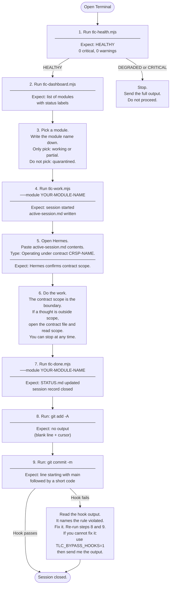
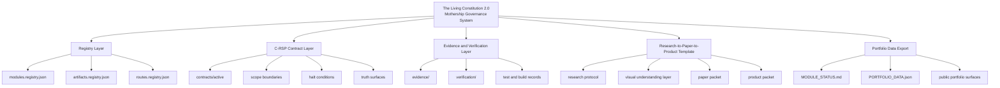
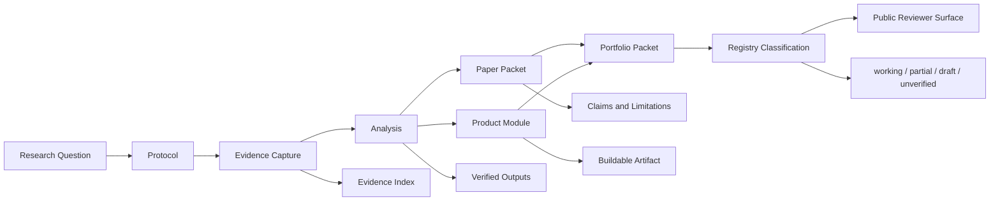
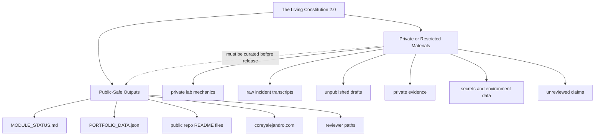

# The Living Constitution 2.0

**The mothership governance system for Corey Alejandro's AI safety research, evidence, product modules, and public reviewer surfaces.**

The Living Constitution 2.0 is the governing control plane for a portfolio of AI safety research and research-engineering projects. It organizes work through registries, C-RSP contracts, evidence records, verification outputs, reusable research templates, and public-safe portfolio data.

This repository is the source of truth for what exists, what is verified, what is partial, what is draft, and what is not claimed.

## Current Functional Status

**Status:** working within verified local governance/control-plane scope.

| Registry Surface | Current Count |
|---|---:|
| Modules | 21 |
| Artifacts | 36 |
| Routes | 18 |

Verified locally with:

```bash
npm run ingest:verify
npm run verify
npm test
```

---

## Who Uses This System

Two kinds of people use this repository.

**The Operator (Corey)** starts governed work sessions, runs the session scripts, and ends sessions. The session loop is the daily workflow. Start point: `docs/HOW-TO-USE.md`.

**The Reviewer (external researcher, funder, collaborator)** reads the registry and status files to understand what exists and what is claimed. Start point: `MODULE_STATUS.md`.

---

## Operator Userflow

This diagram shows what the operator does in a normal work session — from opening Terminal to closing the session.



**Step-by-step instructions with exact commands, expected output, and stop conditions:**
`docs/HOW-TO-USE.md`

---

## System Topology



## Research-to-Paper-to-Product Pipeline



## Public and Private Boundary



---

## What This Repository Governs

The Living Constitution 2.0 governs:

- project modules
- artifact records
- public routes
- C-RSP contracts
- evidence records
- verification outputs
- reusable research repo templates
- public and private publication boundaries
- portfolio-safe data exports
- truth-status labels

## C-RSP Is a Subsystem

C-RSP means Constitutionally-Regulated Single Pass.

C-RSP is a contract mechanism inside The Living Constitution 2.0. It is not the entire system.

C-RSP contracts define objective, scope, not-claimed boundary, dependencies, artifacts, invariants, acceptance criteria, halt conditions, truth surface, and rollback or recovery.

## Required Visual Understanding Layer

Research projects governed by this system must include visual aids. A project is incomplete without a visual understanding layer.

Minimum visual set:

1. Architecture diagram
2. App or workflow diagram
3. User journey diagram
4. Pictograph or process explanation
5. Mock demo, storyboard, or simulation
6. Illustration brief

This requirement exists because the system must reduce cognitive load, not increase it.

## Reviewer Start Points

| Reviewer Need | Start Here |
|---|---|
| System status | MODULE_STATUS.md |
| Module registry | registry/modules.registry.json |
| Artifact registry | registry/artifacts.registry.json |
| Route registry | registry/routes.registry.json |
| Research template | templates/tlc-research-to-paper-to-product-template/ |
| Public portfolio data | PORTFOLIO_DATA.json |
| Active C-RSP contracts | contracts/active/ |
| Operator instructions | docs/HOW-TO-USE.md |

## Public Surfaces

Primary public site:

https://coreyalejandro.com

Static Living Constitution site repository:

https://github.com/coreyalejandro/the-living-constitution-2.0-portfolio

This repository is not the public website. It is the governing system that produces and verifies public-safe status data.

## What This Repository Does Not Claim

This repository does not claim:

- every registered module is production-ready
- every research project is complete
- every artifact is publication-ready
- every route is deployed
- every public surface is final
- the repository itself is a deployed web app
- the public portfolio and governance runtime are the same system
- C-RSP is the entire system

## Naming Boundary

Canonical name:

The Living Constitution 2.0

Repository slug:

the-living-constitution-2.0

The term sociotechnical may appear in descriptions and research framing, but it is not the repository name.

No repo, project, module, artifact, route, or system name should be changed without explicit user approval.

## Public Claim Allowed

The Living Constitution 2.0 is a working local governance-control-plane repository for organizing AI safety research, evidence, project modules, C-RSP contracts, reusable research templates, and portfolio-safe public status data within verified local scope.
