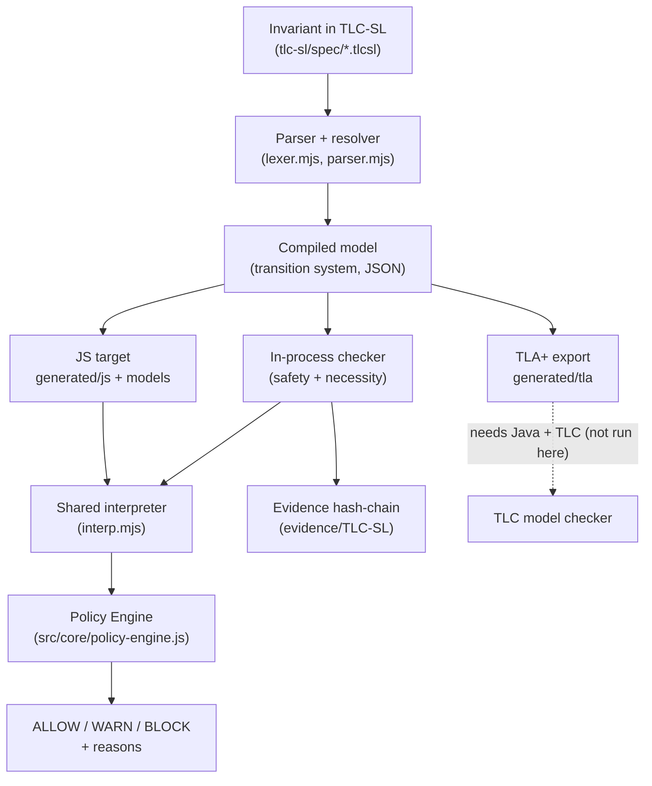
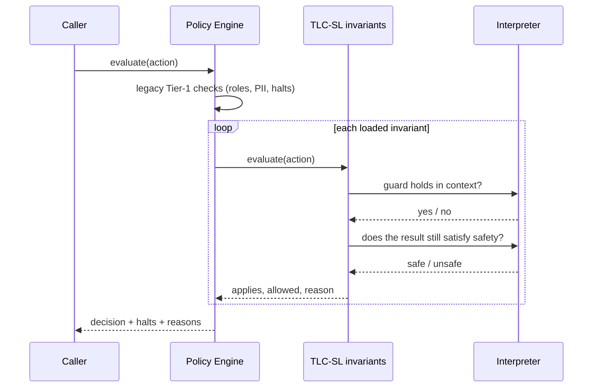
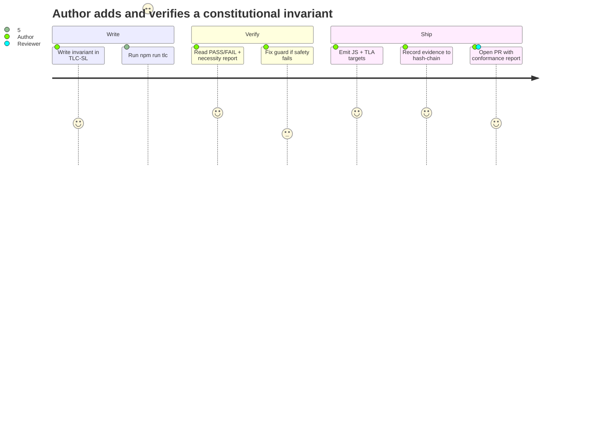

# TLC-SL — Visual Understanding Layer

This is the visual understanding layer required by Constitution Article VI (Invariant I8)
for any `governance_core` module. Every diagram has a plain-language description for
screen readers and for readers who do not parse diagrams easily.

---

## 1. Architecture — one source of truth, three targets

**Plain-language description.** One invariant is written once in TLC-SL. The parser turns it
into a compiled model (a small state machine). That single model feeds three targets: a
JavaScript module that enforces it at runtime, an in-process checker that proves it, and a
TLA+ file for external model checking. The runtime target and the checker both evaluate
through the *same* interpreter, so enforcement and proof cannot disagree. The Policy Engine
uses the runtime target to return ALLOW, WARN, or BLOCK with reasons. The checker writes its
results to the append-only evidence hash-chain. The TLA+ file is exported but not run in this
build because the TLC model checker needs a Java runtime that is not present here.

---

## 2. Workflow — how an action is judged at runtime

**Plain-language description.** A caller asks the Policy Engine to judge an action. The engine
first runs its original Tier-1 checks. Then, for each loaded TLC-SL invariant, it asks: is
this operation permitted in the current context (does its guard hold), and would performing
it keep the system safe? Each invariant answers whether it applies, whether the action is
allowed, and why. The engine combines all answers into one decision with a list of the
invariants that fired and human-readable reasons.

---

## 3. User journey — an author hardens an invariant

**Plain-language description.** An author writes an invariant in TLC-SL, then runs the
checker. They read whether each invariant holds and whether its guards are load-bearing. If a
safety property fails, the checker shows a counterexample and the author fixes the guard. Once
everything passes, the author emits the runtime and TLA+ targets, records the verification to
the evidence chain, and opens a pull request that includes the generated conformance report so
a reviewer can see exactly what was verified.

---

## 4. The core mechanism in one sentence

A constitutional invariant is a **safety property over a small state machine**; TLC-SL lets you
write that machine once and then *both* enforce it on live actions *and* exhaustively prove no
reachable state violates it — and prove each guard is load-bearing by showing safety breaks
when the guard is removed.

## 5. Illustration brief (for non-diagram surfaces)

The intended visual identity is **a single seed compiling into three branches**: one branch is
a running gate (runtime), one is a proof/checkmark (model check), one is a formal scroll (TLA+).
The seed is the written constitution; the three branches are the targets. Keep it austere and
technical — this is verification infrastructure, not marketing. Avoid glow, circuitry clichés,
and robot imagery.
